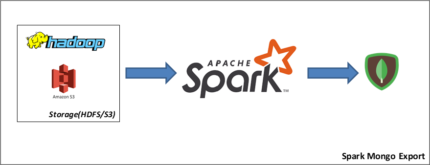

## ***Spark Mongo Export***

*Reusable Spark Scala application to export files from `HDFS`/`S3` into Mongo Collection.*

### ***Table of Contents***
1. [*Application Flow*](#application-flow)
1. [*How This Application Works ?*](#how-this-application-works-?)
1. [*Read Configuration*](#read-configuration)
1. [*Write Configuration*](#write-configuration)
1. [*Project Build and Setup*](#project-build-and-setup)
1. [*Application Options*](#application-options)
1. [*Log4j Properties File*](#log4j-properties-file)
1. [*Spark Struct JSON Schema - Sample*](#spark-struct-json-schema---sample)
1. [*Application Invocation*](#application-invocation)
1. [*Application Invocation - With Read and Write Options*](#application-invocation---with-read-and-write-options)
1. [*shardKey Option to Perform Upsert Based on Custom ID Columns*](#shardkey-option-to-perform-upsert-based-on-custom-id-columns)
1. [*Additional Spark Configurations for AWS S3 Bucket Data*](#additional-spark-configurations-for-aws-s3-bucket-data)
1. [*Sample Application Log File*](#sample-application-log-file)


#### ***Application Flow***

<br>

#### ***How This Application Works ?***
When user invokes the application using `spark-submit` 

1. First, the application will parse and validate the input options.
1. Instantiate new `SparkSession` with mongo config `spark.mongodb.output.uri`.
1. Depending on the input options provided by the user `DataFrame` will be created for source data file.
1. If user provided a transformation `SQL` a temporary view will be created on source `DataFrame` and transformation will be applied to form transformed `DataFrame` or the source DataFrame will used for writing the data to Mongo Collection.
1. Finally, either transformed `DataFrame` or Source `DataFrame` will be written into Mongo Collection depending on the write configuration provided by user or default write configuration.

#### ***Read Configuration***
- By default, application will infer the schema from source file and creates a `DataFrame`. 
- If user don't want to inferSchema from the file they can also create a Spark Struct Schema JSON and pass it as a file using `--schemaPath` option.
- If user wants additional configuration they can use `--readOptions` to provide additional configuration.
- Each option in `--readOptions` is single quote (`'`) separated `key=value` pair and keys are case sensitive.
<br> 
e.g: "sep=~'header=false'inferSchema=false"

#### ***Write Configuration***
- By default, application will use `append` mode to export data into Mongo. It can be override by using `--writeMode` option.
- If user want additional write configuration then they can use `--writeOptions`.
- Each option in `--writeOptions` is single quote (`'`) separated `key=value` pair and keys are case sensitive.
<br> 
e.g: "forceInsert=false'replaceDocument=false'shardKey={\\"student_id\\":1,\\"
school\\":1}"

#### ***Project Build and Setup***
> ***Clone the Repository***
> ```bash
> git clone git@github.com:suriyakrishna/scala-spark-reusable-apps.git
> ```
> ***Maven Build***
> ```bash
> cd scala-spark-reusable-apps
> mvn clean package -f ./spark_mongo_export/pom.xml
> ```
#### ***Application Options***

|Short Option|Long Option|Description|Has Argument|Is Required|
|------|------|------|:------:|:------:|
|-uri|--mongoURI|MongoDB URI|Yes|Yes|
|-db|--dbName|MongoDB Database Name|Yes|Yes|
|-cName|--collectionName|MongoDB Collection Name|Yes|Yes|
|-dLocation|--dataLocation|Source Data Location|Yes|Yes|
|-fFormat|--fileFormat|Source Data File Format|Yes|Yes|
|-sPath|--schemaPath|Input Data File Schema Path. Schema will be inferred from file by default. Spark Struct JSON Schema Specification|Yes||
|-rOptions|--readOptions|Spark DF Read Options, case sensitive!. Eg: inferSchema=true'sep=~'header=false|Yes||
|-tSQL|--transformationSQL|SQL to transform the source data before writing to MongoDB. Use view name as 'source_view'|Yes||
|-wMode|--writeMode|Either overwrite or append. Default append i.e. Upsert based on _id if shardKey option is not provided|Yes||
|-wOptions|--writeOptions|Spark Mongo DF Write Options, case sensitive!. Eg: replaceDocument=true'forceInsert=false|Yes||
|-nPartitions|--numPartitions|Parallelism to write to MongoDB. Default 10|Yes||

#### ***Log4j Properties File***
```properties
log4j.rootLogger=ERROR, Y
log4j.appender.Y=org.apache.log4j.ConsoleAppender
# log4j.appender.Y.target=System.err
log4j.appender.Y.layout=org.apache.log4j.PatternLayout
log4j.appender.Y.layout.conversionPattern=%d{MM-dd-yyyy HH:mm:ss.SSS} %c{1} -%5p - %m%n

# Application Logger Configurations
log4j.logger.com.github.suriyakrishna=INFO, app
log4j.appender.app=org.apache.log4j.ConsoleAppender
log4j.appender.app.layout=org.apache.log4j.PatternLayout
log4j.appender.app.layout.conversionPattern=%d{MM-dd-yyyy HH:mm:ss.SSS} %15c{1} -%5p - %m%n
log4j.additivity.com.github.suriyakrishna=false
```

#### ***Spark Struct JSON Schema - Sample***
```json
{
    "type": "struct",
    "fields": [
        {
            "name": "ID",
            "type": "integer",
            "nullable": true,
            "metadata": {}
        },
        {
            "name": "Name",
            "type": "string",
            "nullable": true,
            "metadata": {}
        },
        {
            "name": "CountryCode",
            "type": "string",
            "nullable": true,
            "metadata": {}
        },
        {
            "name": "District",
            "type": "string",
            "nullable": true,
            "metadata": {}
        },
        {
            "name": "Population",
            "type": "integer",
            "nullable": true,
            "metadata": {}
        }
    ]
}
```

#### ***Application Invocation***
```bash
#!/usr/bin/env bash

# ENVIRONMENTAL VARIABLES
APPLICATION_DIRECTORY="/home/hadoop/spark_reusable_application/spark_mongo_export"
APPLICATION_JAR=${APPLICATION_DIRECTORY}/jars/spark_mongo_export_1.0.0.jar
LOG_4J_PROP=${APPLICATION_DIRECTORY}/log4j.properties
APPLICATION_MAIN_CLASS="com.github.suriyakrishna.MongoExport"

# LOG CONFIGURATION
LOG_DIRECTORY=${APPLICATION_DIRECTORY}/logs
RUN_DATE=$(date +"%Y-%m-%d_%H-%M-%S")
LOG_FILE=${LOG_DIRECTORY}/spark_mongo_export_${RUN_DATE}.log

# CREATE LOG DIRECTORY IF NOT EXISTS
if [[ -d ${LOG_DIRECTORY} ]];
then
    mkdir -p ${LOG_DIRECTORY}
fi

# APPLICATION CONFIGURATION
MONGO_URI="mongodb://localhost:27017"
DB_NAME="test"
COLLECTION_NAME="world_city"
SOURCE_DATA_LOCATION="/user/hadoop/spark_jdbc_import_out/world/city"
SOURCE_FILE_FORMAT="parquet"
WRITE_MODE="overwrite"
SCHEMA_FILE="/home/hadoop/spark_reusable_application/spark_mongo_export/world_city_schema.json" # SCHEMA IN EDGE NODE
TRANSFORM_SQL="SELECT ID as _id, Name, CountryCode, District, Population, current_timestamp() AS RecordInsertTMS FROM source_view"
NUM_PARTITIONS=1

# SPARK FILES CONFIGURATION
SPARK_FILES="${SCHEMA_FILE}#world_city_schema.json" # Schema file should be passed as spark files while running in yarn mode
SCHEMA_FILE_NAME="world_city_schema.json"

spark-submit --master yarn \
--deploy-mode cluster \
--files ${SPARK_FILES} \
--conf spark.executor.extraJavaOptions=-Dlog4j.configuration=file://${LOG_4J_PROP} \
--conf spark.driver.extraJavaOptions=-Dlog4j.configuration=file://${LOG_4J_PROP} \
--class ${APPLICATION_MAIN_CLASS} \
${APPLICATION_JAR} \
--mongoURI ${MONGO_URI} \
--dbName ${DB_NAME} \
--collectionName ${COLLECTION_NAME} \
--dataLocation ${SOURCE_DATA_LOCATION} \
--fileFormat ${SOURCE_FILE_FORMAT} \
--schemaPath ${SCHEMA_FILE_NAME} \
--writeMode ${WRITE_MODE} \
--transformationSQL "${TRANSFORM_SQL}" \
--numPartitions ${NUM_PARTITIONS} &> ${LOG_FILE}
```

#### ***Application Invocation - With Read and Write Options***
```bash
#!/usr/bin/env bash

# ENVIRONMENTAL VARIABLES
APPLICATION_DIRECTORY="/home/hadoop/spark_reusable_application/spark_mongo_export"
APPLICATION_JAR=${APPLICATION_DIRECTORY}/jars/spark_mongo_export_1.0.0.jar
LOG_4J_PROP=${APPLICATION_DIRECTORY}/log4j.properties
APPLICATION_MAIN_CLASS="com.github.suriyakrishna.MongoExport"

# LOG CONFIGURATION
LOG_DIRECTORY=${APPLICATION_DIRECTORY}/logs
RUN_DATE=$(date +"%Y-%m-%d_%H-%M-%S")
LOG_FILE=${LOG_DIRECTORY}/spark_mongo_export_${RUN_DATE}.log

# CREATE LOG DIRECTORY IF NOT EXISTS
if [[ -d ${LOG_DIRECTORY} ]];
then
    mkdir -p ${LOG_DIRECTORY}
fi

# APPLICATION CONFIGURATION
MONGO_URI="mongodb://localhost:27017"
DB_NAME="test"
COLLECTION_NAME="student"
SOURCE_DATA_LOCATION="/user/hadoop/students.csv"
SOURCE_FILE_FORMAT="csv"
WRITE_MODE="append"
SCHEMA_FILE="/home/hadoop/spark_reusable_application/spark_mongo_export/student/student-schema.json"
TRANSFORM_SQL="SELECT monotonically_increasing_id() AS _id, map('name', name, 'age', age, 'section', section) AS details, current_timestamp() AS recordInsertTMS FROM source_view"
READ_OPTIONS="inferSchema=true'sep=~'header=false" # Options are separated by single quote
WRITE_OPTIONS="replaceDocument=false'forceInsert=false" # Options are separated by single quote
NUM_PARTITIONS=1

# SPARK FILES CONFIGURATION
SPARK_FILES="${SCHEMA_FILE}#student-schema.json"
SCHEMA_FILE_NAME="student-schema.json"

spark-submit --master yarn \
--deploy-mode cluster \
--files ${SPARK_FILES} \
--conf spark.executor.extraJavaOptions=-Dlog4j.configuration=file://${LOG_4J_PROP} \
--conf spark.driver.extraJavaOptions=-Dlog4j.configuration=file://${LOG_4J_PROP} \
--class ${APPLICATION_MAIN_CLASS} \
${APPLICATION_JAR} \
--mongoURI ${MONGO_URI} \
--dbName ${DB_NAME} \
--collectionName ${COLLECTION_NAME} \
--dataLocation ${SOURCE_DATA_LOCATION} \
--fileFormat ${SOURCE_FILE_FORMAT} \
--writeMode ${WRITE_MODE} \
--schemaPath ${SCHEMA_FILE_NAME} \
--transformationSQL "${TRANSFORM_SQL}" \
--writeOptions "${WRITE_OPTIONS}" \
--readOptions "${READ_OPTIONS}" \
--numPartitions ${NUM_PARTITIONS} &> ${LOG_FILE}
```

#### ***shardKey Option to Perform Upsert Based on Custom ID Columns***
```bash
# shardKey in write options to perform upsert based on student_id and school columns
WRITE_OPTIONS="replaceDocument=false'forceInsert=false'shardKey={\"student_id\":1,\"school\":1}" 
```

#### ***Additional Spark Configurations for AWS S3 Bucket Data***
```bash
export AWS_ENDPOINT="MY_AWS_ENDPOINT"
export AWS_ACCESS_KEY_ID="MY_ACCESS_KEY"
export AWS_ACCESS_SECRET_KEY="MY_SECRET_KEY"

--conf spark.hadoop.fs.s3a.endpoint=${AWS_ENDPOINT} 
--conf spark.hadoop.fs.s3a.access.key=${AWS_ACCESS_KEY_ID} 
--conf spark.hadoop.fs.s3a.secret.key=${AWS_ACCESS_SECRET_KEY} 
```

#### ***Sample Application Log File***
```log
05-14-2021 19:48:09.883     MongoExport - INFO - ############################################################
05-14-2021 19:48:09.885     MongoExport - INFO - SPARK MONGO EXPORT - Spark-Mongo-Export-test-spark_test-2021-05-14_19-48-09
05-14-2021 19:48:09.885     MongoExport - INFO - ------------------------------------------------------------
05-14-2021 19:48:09.896     MongoExport - INFO - 
#################### User Input ####################
dbName            : test
collectionName    : spark_test
dataLocation      : file:\\\\\\C:\\Users\\Kishan\\IdeaProjects\\ReusableScalaSparkApplications\\spark_mongo_export\\src\\test\\resources\\student_test.csv
fileFormat        : csv
writeMode         : overwrite
schemaPath        : C:\\Users\\Kishan\\IdeaProjects\\ReusableScalaSparkApplications\\spark_mongo_export\\src\\test\\resources\\student-test-schema.json
transformationSQL : SELECT student_id as _id, name, age, school, update_dt, current_timestamp() AS record_insert_tms FROM source_view
readOptions       : Map(inferSchema -> true, sep -> ,, header -> true)
writeOptions      : Map(database -> test, collection -> spark_test, replaceDocument -> false, forceInsert -> false)
numPartitions     : 1
####################################################
    
05-14-2021 19:48:09.897     MongoExport - INFO - ------------------------------------------------------------
05-14-2021 19:48:18.342     MongoExport - INFO - Spark ApplicationID : local-1621001897739
05-14-2021 19:48:18.580     MongoExport - INFO - ------------------------------------------------------------
05-14-2021 19:48:18.581     MongoExport - INFO - Creating Source DataFrame
05-14-2021 19:48:21.605     MongoExport - INFO - Source DataFrame Schema
root
 |-- student_id: integer (nullable = true)
 |-- name: string (nullable = true)
 |-- age: integer (nullable = true)
 |-- school: string (nullable = true)
 |-- update_dt: string (nullable = true)

05-14-2021 19:48:21.606     MongoExport - INFO - ------------------------------------------------------------
05-14-2021 19:48:21.607     MongoExport - INFO - Applying transformation on Source DataFrame
05-14-2021 19:48:22.185  TransformUtils - INFO - View with name 'source_view' created to use in transformation
05-14-2021 19:48:22.186  TransformUtils - INFO - Transformation Query
SELECT student_id as _id, name, age, school, update_dt, current_timestamp() AS record_insert_tms FROM source_view
05-14-2021 19:48:22.490     MongoExport - INFO - Transformed DataFrame Schema
root
 |-- _id: integer (nullable = true)
 |-- name: string (nullable = true)
 |-- age: integer (nullable = true)
 |-- school: string (nullable = true)
 |-- update_dt: string (nullable = true)
 |-- record_insert_tms: timestamp (nullable = false)

05-14-2021 19:48:22.491     MongoExport - INFO - ------------------------------------------------------------
05-14-2021 19:48:22.492     MongoExport - INFO - Writing data to MongoDB
05-14-2021 19:48:26.149     MongoExport - INFO - Write Completed
05-14-2021 19:48:26.150     MongoExport - INFO - ------------------------------------------------------------
05-14-2021 19:48:26.151     MongoExport - INFO - SPARK MONGO EXPORT - SUCCESSFUL
05-14-2021 19:48:26.152     MongoExport - INFO - ------------------------------------------------------------
05-14-2021 19:48:26.153     MongoExport - INFO - TIME TOOK - 0days 0hours 0minutes 16seconds
05-14-2021 19:48:26.154     MongoExport - INFO - ############################################################
```